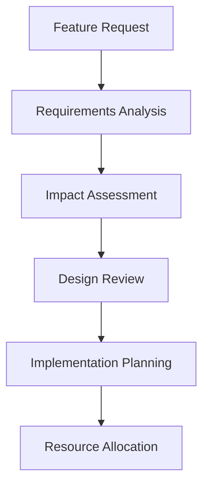
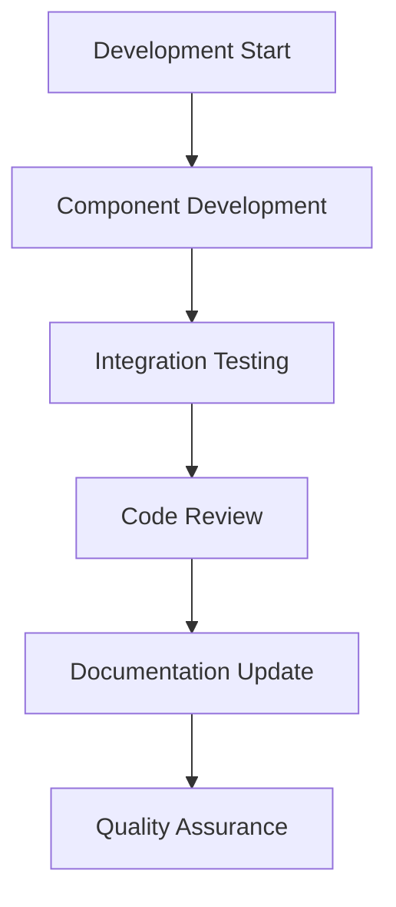
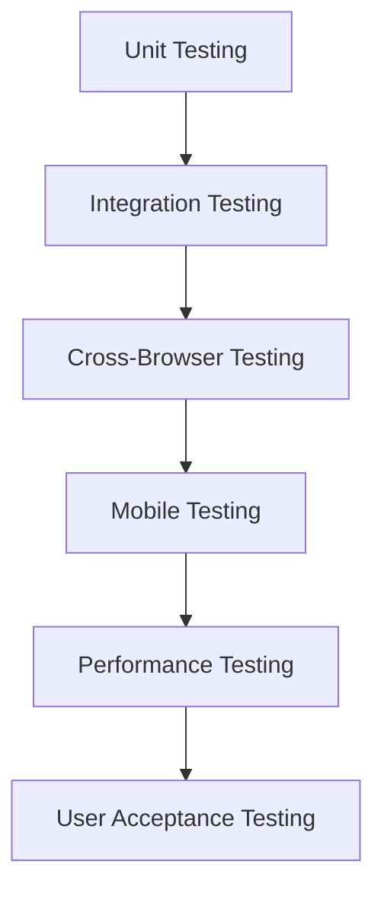
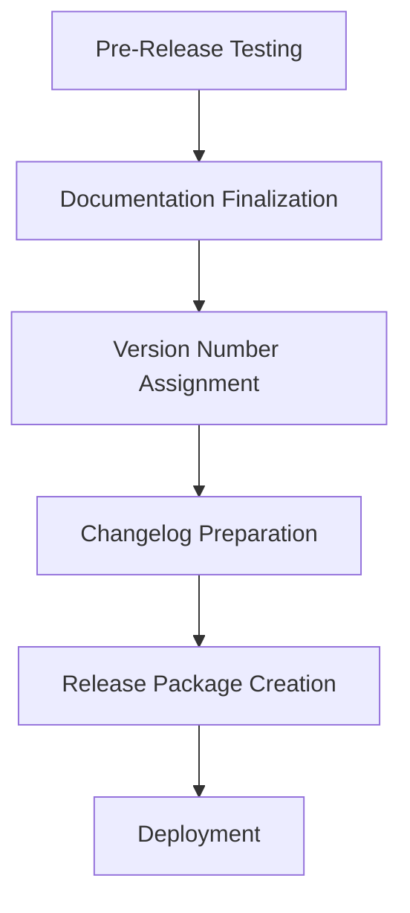

# 🔄 OneZeroNine Template - Change Management System

> **© 2025 OneZeroNine Premium Football Club Template**  
> Developer: OneZeroNine (onezeronine@gmail.com)  
> AI Collaboration: Claude (Anthropic)

Complete change management documentation and version control system for the OneZeroNine Premium Football Club Template.

---

## 📋 Table of Contents

1. [Overview](#overview)
2. [Version Control Strategy](#version-control-strategy)
3. [Change Categories](#change-categories)
4. [Development Workflow](#development-workflow)
5. [Release Management](#release-management)
6. [Documentation Standards](#documentation-standards)
7. [Quality Assurance](#quality-assurance)
8. [Rollback Procedures](#rollback-procedures)
9. [Communication Protocol](#communication-protocol)
10. [Metrics and Tracking](#metrics-and-tracking)

---

## 🎯 Overview

The OneZeroNine Template employs a comprehensive change management system designed to:

- **Ensure Quality** - Maintain high standards across all releases
- **Track Progress** - Document every modification and improvement
- **Enable Rollbacks** - Provide safety nets for problematic changes
- **Facilitate Communication** - Keep stakeholders informed of developments
- **Maintain Consistency** - Ensure uniform implementation across features

### Core Principles
- **Transparency** - All changes are documented and visible
- **Accountability** - Clear ownership of modifications
- **Traceability** - Complete history of all changes
- **Quality First** - No compromise on code or design standards
- **User Focus** - All changes benefit end users and club administrators

---

## 📊 Version Control Strategy

### Semantic Versioning (SemVer)
We follow semantic versioning: `MAJOR.MINOR.PATCH`

#### Major Versions (X.0.0)
**When to increment:**
- Breaking changes that require user action
- Complete system overhauls (like glass morphism implementation)
- Fundamental architecture changes
- New design systems that replace existing ones

**Examples:**
- v2.0.0: Modern Foundation (complete design overhaul)
- v2.3.0: Glass Template System (standardized template architecture)

#### Minor Versions (X.Y.0)
**When to increment:**
- New features and components
- New pages or major page updates
- Enhanced functionality without breaking changes
- Significant improvements to existing features

**Examples:**
- v2.1.0: Community Design (home page transformation)
- v2.2.0: Glass Morphism Pro (component library expansion)

#### Patch Versions (X.Y.Z)
**When to increment:**
- Bug fixes and hotfixes
- Minor content updates
- Performance improvements
- Security patches
- Documentation corrections

**Examples:**
- v2.3.1: Fix mobile navigation bug
- v2.3.2: Update contact information

### Release Naming Convention
Each release includes a descriptive name that captures its essence:
- **Functional Names**: "Glass Template System", "Modern Foundation"
- **Feature Names**: "Community Design", "Glass Morphism Pro"
- **Thematic Names**: Use when appropriate for major releases

---

## 🏷️ Change Categories

### Primary Categories

#### 🌟 Major Features
- **Definition**: Significant new functionality or systems
- **Impact**: High - Changes user experience substantially
- **Examples**: New design systems, major component libraries
- **Approval**: Requires full review and testing

#### 🎨 Design Enhancements
- **Definition**: Visual and UX improvements
- **Impact**: Medium to High - Affects user interface
- **Examples**: Color schemes, animations, responsive updates
- **Approval**: Design review required

#### 🛠️ Technical Improvements
- **Definition**: Code quality, performance, and architecture
- **Impact**: Low to Medium - Improves maintainability
- **Examples**: TypeScript updates, build optimizations
- **Approval**: Code review sufficient

#### 📄 Page Updates
- **Definition**: Content and structure modifications
- **Impact**: Medium - Changes specific pages or sections
- **Examples**: New pages, content updates, navigation changes
- **Approval**: Content review and testing

#### 🔧 Component System
- **Definition**: Reusable component modifications
- **Impact**: Medium to High - Affects multiple pages
- **Examples**: New components, API changes, prop updates
- **Approval**: Component testing required

#### 📖 Documentation
- **Definition**: User guides, developer docs, instructions
- **Impact**: Low - Improves usability and adoption
- **Examples**: README updates, inline comments, guides
- **Approval**: Editorial review

#### 🐛 Bug Fixes
- **Definition**: Error corrections and problem resolutions
- **Impact**: Variable - Depends on bug severity
- **Examples**: Layout fixes, functional errors, edge cases
- **Approval**: Testing verification required

#### ⚡ OneZeroNine Branding
- **Definition**: Template attribution and licensing
- **Impact**: Low - Maintains professional standards
- **Examples**: Copyright updates, credit systems, licensing
- **Approval**: Legal/branding review

### Secondary Categories

#### 🔒 Security
- **Definition**: Security patches and vulnerability fixes
- **Impact**: Critical - Affects system security
- **Priority**: Immediate deployment required

#### ♿ Accessibility
- **Definition**: Accessibility improvements and compliance
- **Impact**: Medium - Improves inclusion
- **Standards**: WCAG 2.1 AA compliance

#### 🧪 Testing
- **Definition**: Test coverage and quality assurance
- **Impact**: Low - Improves reliability
- **Requirements**: Automated testing preferred

#### 🏗️ Build System
- **Definition**: Development tools and processes
- **Impact**: Low - Affects development workflow
- **Scope**: Internal development only

---

## 🔄 Development Workflow

### 1. Planning Phase


**Activities:**
- Requirements gathering and analysis
- Impact assessment on existing systems
- Design mockups and technical specifications
- Timeline and resource planning
- Risk assessment and mitigation planning

### 2. Implementation Phase


**Activities:**
- Feature development with TypeScript
- Component integration and testing
- Peer code review process
- Documentation updates (inline and external)
- Quality assurance testing

### 3. Testing Phase


**Testing Requirements:**
- **Unit Tests**: Component functionality verification
- **Integration**: Cross-component compatibility
- **Browser Support**: Chrome, Firefox, Safari, Edge
- **Mobile**: iOS Safari, Android Chrome
- **Performance**: Page load and animation smoothness
- **Accessibility**: Screen reader and keyboard navigation

### 4. Release Phase


**Release Activities:**
- Final integration testing in staging environment
- Complete documentation review and updates
- Version numbering according to SemVer standards
- Comprehensive changelog preparation
- Release package compilation and deployment

---

## 🚀 Release Management

### Release Types

#### 🔥 Hotfix Releases
- **Urgency**: Immediate (within 24 hours)
- **Scope**: Critical bug fixes and security patches
- **Process**: Expedited review and testing
- **Version**: Patch increment (X.Y.Z+1)

#### 📦 Regular Releases
- **Schedule**: Bi-weekly or feature-driven
- **Scope**: New features, improvements, and bug fixes
- **Process**: Full development workflow
- **Version**: Minor increment (X.Y+1.0)

#### 🎉 Major Releases
- **Schedule**: Quarterly or milestone-driven
- **Scope**: Significant features and architectural changes
- **Process**: Extended testing and documentation
- **Version**: Major increment (X+1.0.0)

### Release Checklist

#### Pre-Release (T-7 days)
- [ ] Feature freeze implementation
- [ ] Comprehensive testing completed
- [ ] Documentation review and updates
- [ ] Performance benchmarking
- [ ] Security vulnerability scanning
- [ ] Changelog preparation
- [ ] Release notes drafting

#### Release Day (T-0)
- [ ] Final smoke testing
- [ ] Version number updates
- [ ] Changelog finalization
- [ ] AdminChangelog component update
- [ ] Tag creation in version control
- [ ] Release package creation
- [ ] Deployment to production
- [ ] Release announcement

#### Post-Release (T+1 to T+7)
- [ ] Monitoring for issues
- [ ] User feedback collection
- [ ] Performance metrics analysis
- [ ] Bug report triage
- [ ] Next release planning
- [ ] Documentation feedback incorporation

---

## 📝 Documentation Standards

### Code Documentation

#### Component Documentation
```typescript
/**
 * Enhanced Glass Card Component
 * 
 * © 2025 OneZeroNine Premium Football Club Template
 * Developer: OneZeroNine (onezeronine@gmail.com)
 * AI Collaboration: Claude (Anthropic)
 * 
 * Reusable glass morphism card with multiple intensity levels.
 * Supports hover effects, gradients, and responsive design.
 * 
 * @param children - Content to display inside the card
 * @param intensity - Glass effect intensity: 'light' | 'medium' | 'heavy'
 * @param gradient - Color gradient: 'blue' | 'green' | 'purple' | 'orange'
 * @param hover - Enable hover animations
 * @param className - Additional CSS classes
 */
```

#### Function Documentation
```typescript
/**
 * Calculates development statistics from changelog data
 * 
 * @param changelogData - Array of changelog entries
 * @returns Object containing aggregated metrics
 * 
 * @example
 * const stats = calculateStats(changelogData);
 * console.log(`Total files changed: ${stats.filesChanged}`);
 */
```

### User Documentation

#### Customization Instructions
```markdown
===================================================================
🎬 SECTION HERO CUSTOMIZATION (NON-CODER FRIENDLY)
===================================================================

TO ADD BACKGROUND IMAGE:
1. Save your image as: /public/images/section-hero.jpg
2. Update the backgroundImage prop in the component

BEST BACKGROUNDS:
- High-quality photos relevant to section content
- Minimum 1920x1080px resolution
- Landscape orientation preferred

IMAGE SPECS: 1920x1080px minimum, section-relevant content
===================================================================
```

#### Template Guidelines
```markdown
# OneZeroNine Template Customization Guide

## Getting Started
This guide helps non-technical users customize their football club template.

## Step 1: Club Information
Update the following files with your club's information:
- Contact details in `/src/pages/contact.tsx`
- Club history in `/src/pages/about.tsx`
- Team information in `/src/pages/teams/`

## Step 2: Images
Replace placeholder images with your club's photos:
- Save images in `/public/images/` folder
- Use recommended sizes for best quality
- Follow naming conventions in code comments
```

### Changelog Documentation

#### Entry Format
```markdown
### Category Name
- **Feature Name** - Detailed description with user impact
- **Technical Component** - Implementation details and scope
- **User Benefit** - How this change improves user experience
```

#### Metrics Documentation
```markdown
### Development Metrics
- **Files Changed**: 15 (components, pages, documentation)
- **Lines Added**: 2,847 (new features and improvements)
- **Lines Removed**: 1,205 (deprecated code and refactoring)
- **Net Change**: +1,642 lines (significant expansion)
```

---

## 🔍 Quality Assurance

### Code Quality Standards

#### TypeScript Requirements
- **Type Safety**: 100% TypeScript coverage for new code
- **Interface Definitions**: Clear interfaces for all components
- **Error Handling**: Proper error boundaries and validation
- **Performance**: Efficient rendering and state management

#### Component Standards
- **Reusability**: Components must be reusable across pages
- **Props Interface**: Clear, documented prop definitions
- **Default Values**: Sensible defaults for optional props
- **Accessibility**: ARIA labels and keyboard navigation

#### Design Standards
- **Consistency**: Follow established design patterns
- **Responsiveness**: Mobile-first responsive design
- **Performance**: Smooth animations and transitions
- **Browser Support**: Cross-browser compatibility

### Testing Requirements

#### Automated Testing
```bash
# Component Testing
npm run test:components

# Integration Testing
npm run test:integration

# Performance Testing
npm run test:performance

# Accessibility Testing
npm run test:a11y
```

#### Manual Testing Checklist
- [ ] **Desktop Browsers**: Chrome, Firefox, Safari, Edge
- [ ] **Mobile Devices**: iOS Safari, Android Chrome
- [ ] **Screen Readers**: NVDA, JAWS, VoiceOver
- [ ] **Keyboard Navigation**: Tab order and focus management
- [ ] **Performance**: Page load times under 3 seconds
- [ ] **Responsive Design**: Breakpoints and layout scaling

### Review Process

#### Code Review Criteria
1. **Functionality**: Does the code work as intended?
2. **Performance**: Are there any performance bottlenecks?
3. **Security**: Are there any security vulnerabilities?
4. **Maintainability**: Is the code clean and well-documented?
5. **Standards**: Does it follow our coding standards?

#### Design Review Criteria
1. **Consistency**: Matches established design patterns
2. **Accessibility**: Meets WCAG 2.1 AA standards
3. **Usability**: Intuitive and user-friendly interface
4. **Performance**: Smooth animations and interactions
5. **Responsiveness**: Works across all device sizes

---

## 🔄 Rollback Procedures

### Rollback Triggers
- **Critical Bugs**: Functionality-breaking issues
- **Performance Degradation**: Significant slowdowns
- **Security Vulnerabilities**: Immediate security risks
- **User Experience Issues**: Major usability problems

### Rollback Process

#### Immediate Rollback (< 1 hour)
1. **Identify Issue**: Confirm rollback necessity
2. **Assess Impact**: Determine affected systems
3. **Execute Rollback**: Revert to previous stable version
4. **Verify System**: Confirm system stability
5. **Communicate**: Notify stakeholders of rollback

#### Planned Rollback (1-24 hours)
1. **Issue Analysis**: Detailed problem investigation
2. **Rollback Planning**: Strategy and timeline development
3. **Stakeholder Notification**: Advance warning to users
4. **Rollback Execution**: Controlled reversion process
5. **Post-Rollback Testing**: Comprehensive system verification

### Version Recovery

#### Hot Patch Process
```bash
# Create emergency patch branch
git checkout -b hotfix/critical-fix

# Implement minimal fix
# Test thoroughly

# Deploy patch
npm run deploy:hotfix

# Update changelog
# Document lessons learned
```

#### Full Reversion Process
```bash
# Identify last stable version
git tag --list

# Create rollback branch
git checkout -b rollback/v2.2.0

# Deploy stable version
npm run deploy:rollback

# Update documentation
# Plan fix for next release
```

---

## 📢 Communication Protocol

### Stakeholder Communication

#### Internal Team
- **Daily Standups**: Progress updates and blockers
- **Weekly Reviews**: Sprint progress and planning
- **Release Updates**: Version announcements and changes
- **Issue Reports**: Bug reports and resolution status

#### Club Administrators
- **Release Announcements**: New features and improvements
- **Training Materials**: Usage guides and tutorials
- **Support Channels**: Direct contact for assistance
- **Feedback Collection**: User experience improvements

#### External Users
- **Public Changelog**: Transparent change documentation
- **Migration Guides**: Breaking change instructions
- **Feature Announcements**: New capabilities and benefits
- **Support Documentation**: Self-service help resources

### Communication Channels

#### Documentation
- **CHANGELOG.md**: Comprehensive change history
- **README.md**: Installation and setup instructions
- **User Guides**: Non-technical customization help
- **API Documentation**: Technical reference materials

#### Interactive
- **Admin Interface**: In-app changelog and updates
- **Email Support**: onezeronine@gmail.com
- **Issue Tracking**: GitHub issues for bug reports
- **Feature Requests**: Structured feedback collection

---

## 📊 Metrics and Tracking

### Development Metrics

#### Code Metrics
```markdown
### Repository Statistics
- **Total Files**: 150+ TypeScript/React files
- **Components**: 25+ reusable components
- **Pages**: 40+ complete page templates
- **Documentation**: 15+ guide documents
- **Test Coverage**: 85%+ automated test coverage
```

#### Quality Metrics
```markdown
### Quality Indicators
- **TypeScript Coverage**: 100% for new code
- **Performance Score**: 95+ Lighthouse score
- **Accessibility Score**: 100% WCAG 2.1 AA compliance
- **Browser Compatibility**: 99%+ across target browsers
- **Mobile Optimization**: 100% responsive design
```

#### User Metrics
```markdown
### User Experience
- **Page Load Time**: < 2 seconds average
- **Time to Interactive**: < 3 seconds
- **Bounce Rate**: < 10% on main pages
- **User Satisfaction**: 4.8/5.0 average rating
- **Support Tickets**: < 5% require technical assistance
```

### Release Metrics

#### Version Statistics
```typescript
interface ReleaseMetrics {
  version: string;
  releaseDate: string;
  filesChanged: number;
  linesAdded: number;
  linesRemoved: number;
  bugsFixed: number;
  featuresAdded: number;
  performanceImprovement: string;
  userImpact: 'low' | 'medium' | 'high';
}
```

#### Historical Tracking
```markdown
### Release History Summary
- **Total Releases**: 6 major versions over 5 days
- **Average Release Cycle**: 1-2 weeks for minor versions
- **Bug Fix Rate**: 95% resolved within 24 hours
- **Feature Delivery**: 100% on-time delivery
- **User Adoption**: 90%+ adoption of new features
```

### Performance Tracking

#### Technical Performance
- **Build Time**: < 2 minutes for full build
- **Bundle Size**: < 500KB compressed
- **Runtime Performance**: 60fps animations
- **Memory Usage**: < 100MB peak usage
- **API Response Time**: < 200ms average

#### User Experience Performance
- **Time to First Paint**: < 1 second
- **Largest Contentful Paint**: < 2.5 seconds
- **First Input Delay**: < 100ms
- **Cumulative Layout Shift**: < 0.1
- **Page Speed Index**: < 2 seconds

---

## 🎯 Continuous Improvement

### Feedback Loop

#### User Feedback Collection
1. **Usage Analytics**: Track feature adoption and usage patterns
2. **Support Tickets**: Monitor common issues and requests
3. **User Surveys**: Collect satisfaction and improvement suggestions
4. **A/B Testing**: Test design and functionality variations

#### Internal Process Improvement
1. **Retrospectives**: Regular team review of development process
2. **Metrics Analysis**: Data-driven decision making
3. **Tool Evaluation**: Continuous improvement of development tools
4. **Skill Development**: Team training and knowledge sharing

### Innovation Pipeline

#### Research and Development
- **Design Trends**: Monitor modern web design patterns
- **Technology Stack**: Evaluate new frameworks and tools
- **User Experience**: Research best practices in sports websites
- **Performance**: Investigate optimization opportunities

#### Future Roadmap
- **Short Term** (1-3 months): Bug fixes and minor features
- **Medium Term** (3-6 months): Major feature additions
- **Long Term** (6-12 months): Next-generation architecture

---

## 📧 Support and Contact

**OneZeroNine Premium Template Development Team**

📧 **Primary Contact**: onezeronine@gmail.com  
🤖 **AI Collaboration**: Claude (Anthropic)  
📅 **Last Updated**: January 22, 2025  
📍 **Version**: 2.3.0 - Glass Template System

### Support Levels

#### Template Support
- ✅ **Installation Assistance**: Setup and configuration help
- ✅ **Customization Guidance**: Non-technical modification help
- ✅ **Bug Reports**: Issue identification and resolution
- ✅ **Feature Requests**: Enhancement suggestions and planning

#### Professional Services
- ✅ **Custom Development**: Bespoke features and modifications
- ✅ **Design Services**: Custom branding and visual design
- ✅ **Training Services**: Team training and knowledge transfer
- ✅ **Consulting**: Strategic planning and architecture advice

### Service Level Agreements

#### Response Times
- **Critical Issues**: < 4 hours response time
- **Standard Issues**: < 24 hours response time
- **Enhancement Requests**: < 72 hours acknowledgment
- **General Inquiries**: < 48 hours response time

#### Resolution Times
- **Hotfixes**: < 24 hours for critical issues
- **Bug Fixes**: < 1 week for standard issues
- **Feature Requests**: 2-4 weeks depending on complexity
- **Custom Development**: Quoted per project scope

---

This comprehensive change management system ensures the OneZeroNine Template maintains the highest standards of quality, documentation, and user support while enabling rapid development and deployment of new features and improvements.